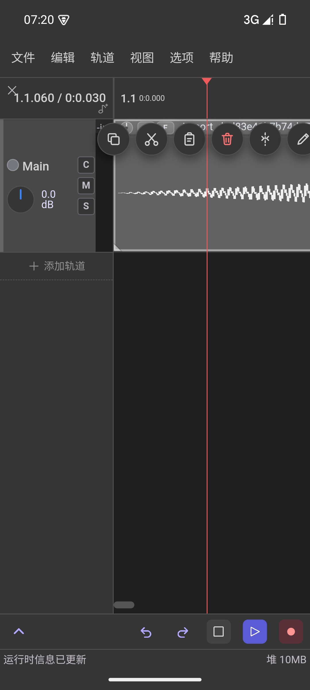
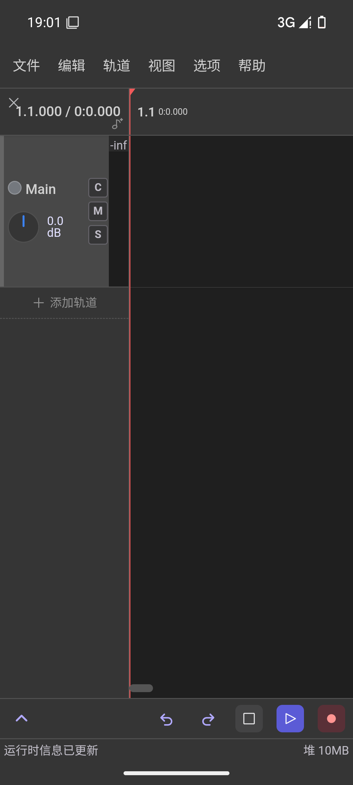

# HiFiShifter Mobile

**简体中文**

把 [HiFiShifter](https://github.com/ARounder-183/HiFiShifter) 移植到 **Android** 的触屏版本。

HiFiShifter 是一个图形化人声编辑与合成工具：以轨道组为单位，支持多轨道音频块处理，
并使用多种声码器完成人声修音与人力调参，实现人力 VOCALOID 制作的「拼调一体化」。
本仓库是它的移动端移植 —— 保留上游的时间线编辑与参数编辑内核，把交互整体改造成**手指可用**：
手势取代鼠标键盘、单面板与分屏取代多窗口、文件访问改走系统 SAF。

> ⚠️ **本项目是非官方移植**，与上游作者无关；上游版权与许可见文末。
>
> **当前仍在开发迭代中，未对全链路进行测试，可能存在诸多 BUG 或不稳定问题。**

| 轨道面板 | 参数面板 |
| :---: | :---: |
|  |  |

## 与桌面版的差异

| | 桌面版 | 本移植版 |
| :--- | :--- | :--- |
| 交互 | 鼠标 + 键盘快捷键 | **全手势**（见下方速查表），无键盘快捷键 |
| 布局 | 轨道 + 参数面板同屏常驻 | 手机 `<1280px`：**单面板**，多面板靠「视图」菜单勾选；屏幕够宽时可**分屏**同屏显示两个面板 |
| 文件 | 直接读写路径 | 系统 **SAF**（文档选择器），不申请存储权限 |
| 平台 | Windows / macOS / Linux | **Android 8.0+（API 26）**，**仅 `arm64-v8a`** |
| 后台播放 | 支持 | **第一版不做**，仅前台编辑与试听 |

上游那些依赖鼠标修饰键的能力（`Alt` 拖动 = 伸缩 / 内部偏移、右键 = 还原 / 框选、
`Shift` = 临时关闭吸附），在移动端都换成了对应手势或工具；复制、剪切、粘贴、删除等编辑操作
则收进音频块的「常用操作」条与工具栏。

## 安装

- 在仓库侧边栏的 **Releases** 里下载 APK 直接安装（`arm64-v8a`，Android 8.0 及以上）。
- 或用 `adb` 侧载：

  ```bash
  adb install -r HiFiShifter-mobile-<version>-arm64-v8a.apk
  ```

首次启动会解压内置的声码器模型（`nsf_hifigan`，约 54 MB），需要一点时间。

## 触屏手势速查

> 权威版本是 [`docs/15-触屏交互规格表.md`](docs/15-触屏交互规格表.md)（含逐格核对，以及
> 「`-` = 不做特殊处理，而不是不处理」这条容易被误读的注解）；下表是它的浓缩。

| 手势 | 轨道 | 音频块 | 轨道头 | 音频块头尾的控制点 | 拍数栏 |
| :--- | :--- | :--- | :--- | :--- | :--- |
| **单击** | 切换轨道 | 选中并显示常用操作与左右控制点 | 切换轨道 | — | 移动进度条 |
| **双击** | 展开全屏编辑 | 展开全屏编辑 | — | — | 移动进度条并开始播放 |
| **划动** | 平移视野 | 未选中：平移视野；已选中：拖动块；**淡入淡出区**：调整淡入淡出时长 | 上下划平移视野；**左划隐藏轨道头**（只留颜色线与电平条），右划再展开 | 更改音频块起始与结束位置 | 左右平移视野 |
| **长按** | — | **淡入淡出区**：打开淡入淡出菜单 | 打开轨道菜单 | 上方出现淡入/淡出图标、下方出现变速缩放图标 | — |
| **长按并划动** | 相当于右键框选 | 拖动块 | 移动轨道顺序 | **上划后横滑**调淡入淡出；**下划后横滑**调变速 | — |
| **双指拖动** | 平移且缩放 | 平移且缩放 | — | — | 平移且缩放 |
| **双指长按并划动** | — | **调整音频相对音频块的位置**（相当于按住 `Alt` 拖动）| — | — | — |

移动端还有几个特有入口：参数工具行（**选择 / 绘制 / 👁 / ∨**）接管了桌面上散落的工具与开关，
长按工具图标可展开子工具（画笔的子工具里另有「还原」，等价于电脑上的右键擦除）。

## 功能介绍

### 布局

与桌面版一致，分成两个功能区：

- **轨道面板**：音频块的编辑与编排（导入、切分、胶合、淡入淡出、增益、静音、轨道组嵌套…）。
- **参数面板**：对音频调参。轨道上有 `C` 按钮（Compose），**只有开启的根轨道**所属的轨道组
  才会被后续调参处理；一个轨道组共用一套算法与参数线。

手机上一次只显示一个面板（顶栏「视图」菜单切换），也可以把两个面板上下分屏同时看。

### 轨道面板

- **媒体导入**：内置文件管理器选择文件；视频文件会自动取其中的音频轨。
- **音频块编辑**：拖动、裁剪、伸缩（桌面 = `Alt` + 拖边界）、内部偏移（Slip，桌面 = `Alt` + 拖块体）、
  淡入淡出、增益、静音、胶合、在播放头切分。
- **轨道组**：轨道可以嵌套成组，组内共用算法与参数线 —— 这是后续调参的基本单位。

### 参数面板

参数面板提供类似 VocalShifter 的操作：实线表示该轨道组当前音高，虚线表示整体原始音高，
彩线表示各音频块自己的原始音高；其它参数面板同理（只是不显示音频块自己的原始音高）。
面板旁边的小眼睛控制「未选中时是否可见」。

### 算法

| 算法 | 可编辑参数 | 备注 |
| :--- | :--- | :--- |
| **World** | 音高 | 老牌声码器，仅支持音高 |
| **PC-NSF-HiFiGAN** | 音高、气声、张力、共振峰、音量 | 歌声特化的 HiFi-GAN；**气声需单独开启**（用 hnsep 的 UVR 模型做气声分离，首次较慢），要编辑张力请务必先开气声 |
| **Vslib** | 音高、声像、共振峰、音量、气声 | VocalShifter 的算法库；官方 dll 只支持文件 IO，因此比本体慢 |

`nsf_hifigan` 模型内置于安装包；`hnsep` / `fcpe` 需要下载后从本地导入。

### 工程与剪贴板互通

沿用上游能力，方便从其它软件迁移工程：可直接打开 VocalShifter / Reaper 工程，
也能解析这两者的剪贴板内容（把参数或 items 粘进当前工程）。

## 构建

前置：JDK 17、Android SDK（API 34 平台 + NDK）、Rust（`aarch64-linux-android` target）、
Node.js 20+ 与 pnpm。

```bash
# 给上游源码打补丁（本仓库不直接改 upstream-src/，改动统一落在 android/patches/）
scripts/apply-patches.sh

# 构建 APK：arm64-v8a 出真机包，x86_64 出模拟器包
scripts/build-apk.sh arm64-v8a
# Windows 等价写法：
# powershell -NoProfile -ExecutionPolicy Bypass -File scripts\build-apk.ps1 arm64-v8a
```

产物位于
`upstream-src/backend/src-tauri/gen/android/app/build/outputs/apk/universal/debug/`。

> **补丁纪律**：`upstream-src/` 视为只读的上游快照，前后端改动一律以 patch 形式存放在
> `android/patches/`。改完源码后必须执行 `scripts/regen-frontend-patch.sh` 并用
> `scripts/verify-patches.sh` 确认逐字节一致，否则下次 `apply-patches` 会失败。

## 文档

- [移植方案总览](docs/01-移植方案总览.md) —— 从这里读起
- [触屏交互规格表](docs/15-触屏交互规格表.md) —— **交互唯一权威**
- [双指手势与视口内核对接规范](docs/08-双指手势与视口内核对接规范.md)
- [小屏排版适配](docs/04-小屏排版适配.md) · [后端改造清单](docs/02-后端改造清单.md)
- [SAF 文件访问设计](docs/11-SAF文件访问设计.md)
- [测试环境与验收](docs/05-测试环境与验收.md) · [踩坑速查](docs/17-踩坑速查.md)
- [开发任务板](docs/TASKS.md) · [需求提示词](docs/prompt.md)

## 致谢

本移植版建立在以下开源项目之上（与上游一致）：

- [HiFiShifter](https://github.com/ARounder-183/HiFiShifter) — 本项目的上游
- [WORLD](https://github.com/mmorise/World) — 高质量语音分析与合成系统
- [SoundTouch](https://www.surina.net/soundtouch/) — 音频时间拉伸与变调库（LGPL）
- [Signalsmith Stretch](https://github.com/Signalsmith-Audio/signalsmith-stretch) — 高质量音频时间拉伸库（MIT）
- [VocalShifter Library (vslib)](https://ackiesound.ifdef.jp/) — 音声解析与合成库
- [SingingVocoders](https://github.com/openvpi/SingingVocoders) — 歌声合成声码器（OpenVPI）
- [HiFi-GAN](https://github.com/jik876/hifi-gan) — 高保真生成对抗网络声码器

## License

上游 [HiFiShifter](https://github.com/ARounder-183/HiFiShifter) 基于 **MIT License** 发布，
本移植版沿用同一许可。
